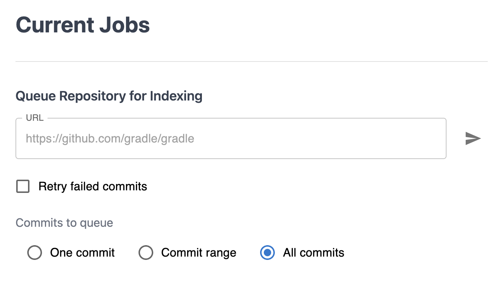
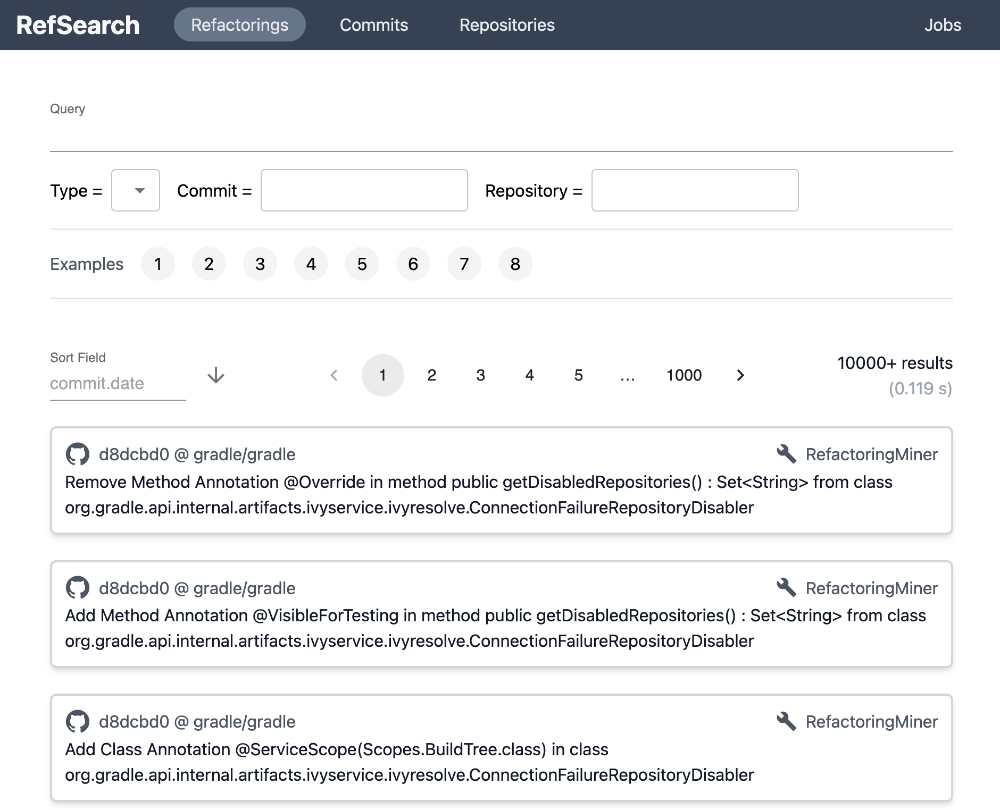
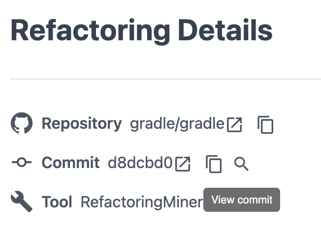

# RefSearch

Playground: https://refsearch.toki317.dev/

## Setup

Requires docker and docker compose v2.

- `make up` to launch the app
- `make down` to tear down the app

Go to http://localhost:8080/ to view the app.

## Usage

### Detect and Load Refactorings from Repository

From the "jobs" page, submit URL of the repository from which you want to detect refactorings.

e.g. `https://github.com/gradle/gradle`



Once submitted, RefSearch runners will automatically pick the jobs up (wait 1 minute at max),
and start detecting refactorings using RefactoringMiner and RefDiff.
Therefore, only refactorings in Java language are recognized.

### View Detected Refactorings

View all detected refactoring instances from the "refactorings" page.



You can search refactorings by:

- Refactoring Type recognized by RefactoringMiner and RefDiff. 
  - Some of the "overlapping" refactoring types with RefactoringMiner and RefDiff have the same type.
- SHA1 commit hash in which the refactoring was detected.
  - The search box supports prefix matching.
- URL of the repository in which the refactoring was detected.
  - The search box uses exact match.
- Other metadata included in refactoring data.
  - Nested fields are chained with dot (`.`).
    - e.g. `extractMethod.sourceMethodsCount`
  - Conditions are chained with `&` or `|`.
    - e.g. `type = "Extract Method" & before.location.lines >= 100`

<details>
<summary>Example of Refactoring Metadata</summary>

This example is based on refactoring detected by RefDiff.
Some fields may differ from refactorings detected by RefactoringMiner.

```json
{
  "_id": "6449778cdfdd69f120621e7e",
  "type": "Extract Method",
  "description": "Extracted method getBuildInitTestFramework(UserInputHandler, BuildInitializer, ModularizationOption) from setupProjectLayout()",
  "sha1": "44eac67d00c122f1c6c9b6d8eb3b4aceeca38e21",
  "repository": "https://github.com/gradle/gradle",
  "url": "https://github.com/gradle/gradle/commit/44eac67d00c122f1c6c9b6d8eb3b4aceeca38e21",
  "meta": {
    "tool": "RefDiff"
  },
  "commit": {
    "date": "2023-01-03T15:17:08.000Z",
    "message": "refactoring",
    "refs": "",
    "body": "- part of: #22682\n\nSigned-off-by: <redacted>\n",
    "authorName": "<redacted>",
    "authorEmail": "<redacted>",
    "url": "https://github.com/gradle/gradle/commit/44eac67d00c122f1c6c9b6d8eb3b4aceeca38e21",
    "size": {
      "files": {
        "changed": 11
      },
      "lines": {
        "inserted": 354,
        "deleted": 327
      }
    },
    "refactorings": {
      "total": 68,
      "perType": {
        "Extract Method": 21,
        "Rename Method": 2,
        "Change Return Type": 4,
        "Remove Parameter": 6,
        "Remove Method Annotation": 13,
        "Change Method Access Modifier": 1,
        "Add Method Modifier": 1,
        "Merge Conditional": 1,
        "Replace Loop With Pipeline": 1,
        "Pull Up Method": 12,
        "Extract And Move Method": 2,
        "Change Signature": 4
      },
      "perTool": {
        "RefactoringMiner": 53,
        "RefDiff": 15
      }
    },
    "tools": {
      "RefactoringMiner": "ok",
      "RefDiff": "ok"
    }
  },
  "before": {
    "type": "Method",
    "name": "setupProjectLayout()",
    "location": {
      "file": "subprojects/build-init/src/main/java/org/gradle/buildinit/tasks/InitBuild.java",
      "begin": "181:5",
      "end": "302:6",
      "bodyBegin": "182:39",
      "bodyEnd": "302:5",
      "lines": 121
    }
  },
  "after": {
    "type": "Method",
    "name": "getBuildInitTestFramework(UserInputHandler, BuildInitializer, ModularizationOption)",
    "location": {
      "file": "subprojects/build-init/src/main/java/org/gradle/buildinit/tasks/InitBuild.java",
      "begin": "260:5",
      "end": "278:6",
      "bodyBegin": "260:170",
      "bodyEnd": "278:5",
      "lines": 19
    }
  },
  "extractMethod": {
    "sourceMethodsCount": 1,
    "sourceMethodLines": 121,
    "extractedLines": 19
  }
}
```

</details>

### View Refactorings per Commit

View refactorings detected in one commit, by clicking "view commit" button in refactoring details page.



Alternatively, you can directly search commits instead of refactorings, from the "commits" page.
The same query syntax can be used against commits metadata.

<details>
<summary>Example of Commit Metadata</summary>

```json
{
  "_id": "44eac67d00c122f1c6c9b6d8eb3b4aceeca38e21",
  "date": "2023-01-03T15:17:08.000Z",
  "message": "refactoring",
  "refs": "",
  "body": "- part of: #22682\n\nSigned-off-by: <redacted>\n",
  "authorName": "<redacted>",
  "authorEmail": "<redacted>",
  "url": "https://github.com/gradle/gradle/commit/44eac67d00c122f1c6c9b6d8eb3b4aceeca38e21",
  "repository": "https://github.com/gradle/gradle",
  "size": {
    "files": {
      "changed": 11
    },
    "lines": {
      "inserted": 354,
      "deleted": 327
    }
  },
  "refactorings": {
    "total": 68,
    "perType": {
      "Extract Method": 21,
      "Rename Method": 2,
      "Change Return Type": 4,
      "Remove Parameter": 6,
      "Remove Method Annotation": 13,
      "Change Method Access Modifier": 1,
      "Add Method Modifier": 1,
      "Merge Conditional": 1,
      "Replace Loop With Pipeline": 1,
      "Pull Up Method": 12,
      "Extract And Move Method": 2,
      "Change Signature": 4
    },
    "perTool": {
      "RefactoringMiner": 53,
      "RefDiff": 15
    }
  },
  "tools": {
    "RefactoringMiner": "ok",
    "RefDiff": "ok"
  }
}
```

</details>

### View Repository Metadata

View registered repository and its refactorings count from "repository" page.

<details>
<summary>Example of Repository Metadata</summary>

```json
{
  "_id": "https://github.com/gradle/gradle",
  "commits": 93385,
  "refactorings": {
    "total": 301186,
    "perType": {
      "Rename Method": 18204,
      "Change Return Type": 15429,
      "Change Method Access Modifier": 4918,
      "Change Signature": 37156,
      "Extract Variable": 3662,
      "Split Parameter": 322,
      "Split Attribute": 236,
      "Rename Variable": 5081,
      "Rename Attribute": 4964,
      "Rename Parameter": 11147,
      "Extract Interface": 683,
      "Pull Up Method": 6663,
      "Extract Superclass": 2236,
      "Replace Attribute With Variable": 459,
      "Move Method": 14145,
      "Move and Rename Method": 643,
      "Change Parameter Type": 23701,
      "Remove Class Modifier": 711,
      "Change Variable Type": 12499,
      "Rename Class": 6830,
      "Change Attribute Type": 10496,
      "Pull Up Signature": 1726,
      "Add Parameter": 17424,
      "Change Class Access Modifier": 1758,
      "Add Class Annotation": 1967,
      "Add Method Annotation": 14475,
      "Inline Method": 2568,
      "Remove Parameter": 9485,
      "Localize Parameter": 623,
      "Merge Variable": 110,
      "Encapsulate Attribute": 1031,
      "Modify Method Annotation": 170,
      "Extract Method": 10016,
      "Move And Inline Method": 697,
      "Inline Variable": 1393,
      "Extract Class": 901,
      "Move Attribute": 3051,
      "Move Class": 12006,
      "Move And Rename Method": 1170,
      "Extract And Move Method": 1165,
      "Extract and Move Method": 1944,
      "Add Thrown Exception Type": 629,
      "Parameterize Variable": 990,
      "Add Attribute Modifier": 1858,
      "Remove Class Annotation": 1375,
      "Remove Attribute Modifier": 866,
      "Change Attribute Access Modifier": 1883,
      "Push Down Attribute": 704,
      "Push Down Method": 3178,
      "Add Method Modifier": 1045,
      "Replace Variable With Attribute": 712,
      "Merge Attribute": 269,
      "Merge Parameter": 500,
      "Move Interface": 1820,
      "Modify Class Annotation": 238,
      "Change Thrown Exception Type": 216,
      "Remove Method Modifier": 584,
      "Pull Up Attribute": 988,
      "Extract Attribute": 407,
      "Change Type Declaration Kind": 313,
      "Remove Method Annotation": 4284,
      "Extract Subclass": 213,
      "Push Down Impl": 680,
      "Rename Interface": 878,
      "Parameterize Attribute": 169,
      "Rename Package": 122,
      "Move Package": 143,
      "Move And Rename Class": 890,
      "Add Variable Modifier": 709,
      "Move and Rename Class": 556,
      "Move Enum": 132,
      "Split Class": 37,
      "Remove Thrown Exception Type": 715,
      "Add Parameter Modifier": 1245,
      "Remove Variable Modifier": 678,
      "Remove Parameter Modifier": 880,
      "Move and Rename Interface": 98,
      "Split Package": 32,
      "Add Class Modifier": 890,
      "Move Source Folder": 921,
      "Merge Class": 56,
      "Invert Condition": 147,
      "Merge Method": 17,
      "Replace Attribute": 13,
      "Split Method": 31,
      "Add Attribute Annotation": 242,
      "Split Conditional": 116,
      "Reorder Parameter": 310,
      "Rename Enum": 62,
      "Move And Rename Attribute": 76,
      "Merge Package": 20,
      "Inline Attribute": 34,
      "Split Variable": 35,
      "Merge Conditional": 61,
      "Remove Attribute Annotation": 198,
      "Add Variable Annotation": 88,
      "Collapse Hierarchy": 53,
      "Add Parameter Annotation": 1390,
      "Remove Parameter Annotation": 394,
      "Remove Variable Annotation": 40,
      "Modify Parameter Annotation": 20,
      "Move and Rename Enum": 11,
      "Replace Loop With Pipeline": 45,
      "Replace Anonymous With Lambda": 979,
      "Merge Catch": 22,
      "Replace Pipeline With Loop": 13,
      "Modify Variable Annotation": 1
    },
    "perTool": {
      "RefDiff": 83263,
      "RefactoringMiner": 217923
    }
  }
}
```

</details>

### (Advanced Usage) Load / Export Refactorings Data

#### Load formatted data via API

`GET https://localhost:8080/api/refactorings`

For query details see [api definition](./backend/src/api/serve/common.ts).

#### Import raw data via CLI

`$ node import.js path/to/data.json`

Example:
`$ docker exec -it rs-backend node backend/src/cmd/import.js path/to/data.json`

To actually load formatted data and to search refactorings,
enqueue jobs from UI after importing raw data.

#### Export raw data (per repository) via CLI
 
`$ node export.js path/to/data.json [repo-url]`

Example:
`$ docker exec -it rs-backend node backend/src/cmd/export.js path/to/data.json https://github.com/gradle/gradle`

## Refactoring Types

RefSearch uses the following tools under the hood to automatically detect refactorings inside repositories' commits.

- [RefactoringMiner](https://github.com/tsantalis/RefactoringMiner) 2.4.0
- [RefDiff](https://github.com/aserg-ufmg/RefDiff) 2.0.0

### Supported Refactoring Types

RefSearch recognizes all refactoring types detected by RefactoringMiner 2.4.0.
You can search these types directly in RefSearch, as these type names are not modified.

e.g. Can be searched as `type = "Extract Method"`

RefSearch recognizes all refactoring types detected by RefDiff 2.0.0.
However, granularity of RefDiff "types" are modified by RefSearch processor to match that of RefactoringMiner. 

e.g. RefDiff detects `type: "EXTRACT", node.type: "Method"` -> Processed and can be searched as `type = "Extract Method"`

<details>
<summary>All (TODO: #n) supported refactoring types in RefSearch</summary>

- Extract Method
- ...

</details>

### Extra Information

Some extra information are available in a set of refactoring types.

#### Extract Method

Fields available as `extractMethod.sourceMethodsCount` etc.

- `sourceMethodLines`: LOC of the source method in extract method.
- `extractedLines`: LOC of the extracted method in extract method.
- `sourceMethodsCount`: Number of the extract method refactorings with the same source method in the same commit.
Number greater than 1 indicates the same functionality was extracted from multiple places.

```typescript
export interface ExtractMethodInfo {
  sourceMethodLines: number
  extractedLines: number
  sourceMethodsCount: number
}
```

#### Rename Refactorings

e.g. Rename Method, Rename Class, ...

Fields available as `rename.from` etc.

- `from`: Contains identifier name of the target element before renaming.
- `to`: Contains identifier name of the target element after renaming.

```typescript
export interface RenameInfo {
  from: string
  to: string
}
```
